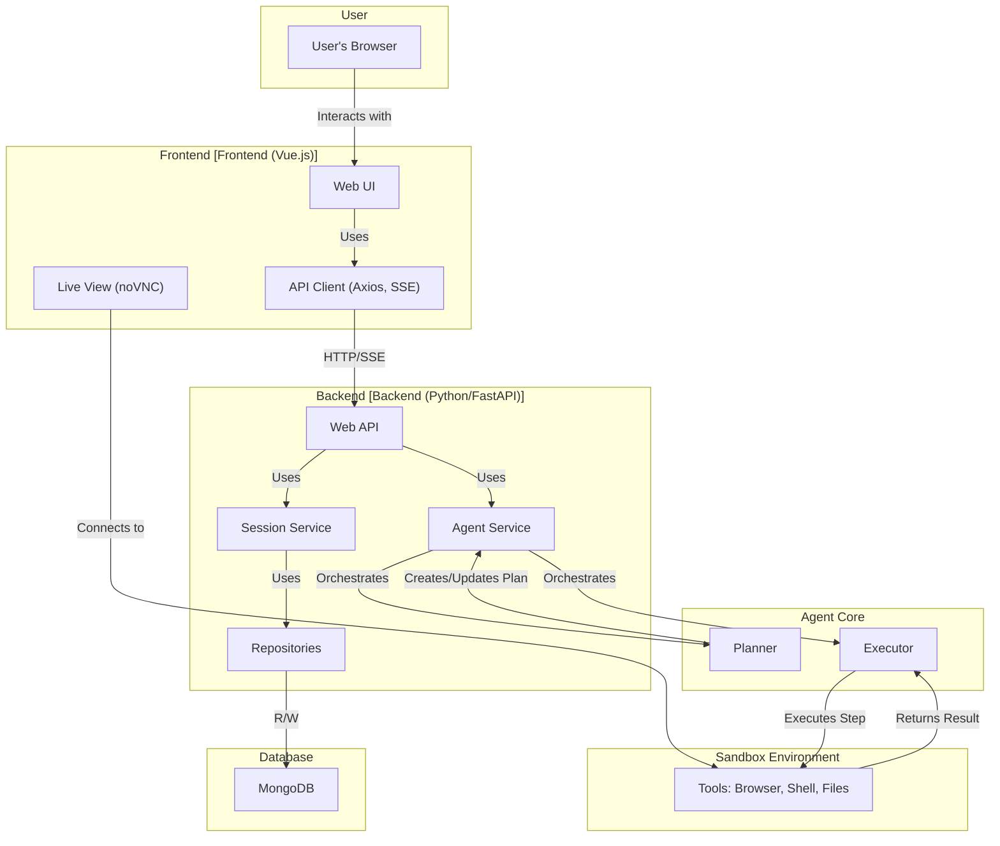
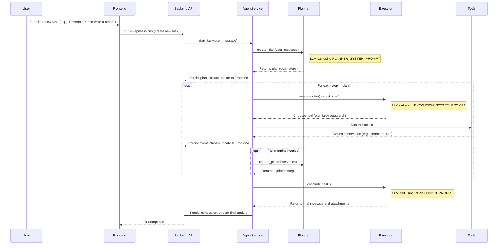
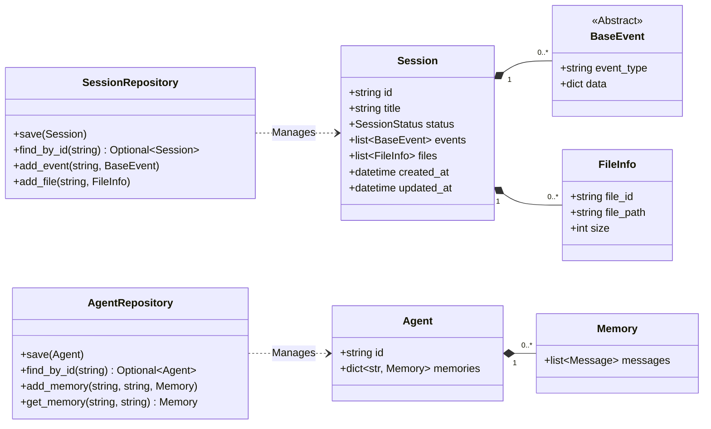

# Manus Project Documentation

## 1. Project Overview

Manus is a sophisticated AI agent platform designed to automate a wide range of tasks that can be performed on a computer with internet access. Users can assign high-level goals, and the Manus agent will autonomously create a plan, execute steps using various tools (like a web browser, shell terminal, and file system), and deliver the final result.

The platform is built with a modern web stack, featuring a Python backend for the agent's core logic and a Vue.js frontend for a rich, interactive user experience.

## 2. System Architecture

The system is composed of several key components that work together to provide the agent's functionality.

### High-Level Architecture Diagram

### Components

*   **Frontend**: A Vue.js single-page application that provides the main user interface. It allows users to manage tasks, interact with the agent, view a live stream of the agent's desktop environment, and browse files generated during a task.
*   **Backend**: A Python application, likely built with FastAPI, that serves the web API and orchestrates the agent's lifecycle.
*   **Agent Core**: The "brain" of the system, composed of two main LLM-powered components:
    *   **Planner**: Analyzes the user's request and generates a high-level, multi-step plan to achieve the goal.
    *   **Executor**: Takes one step from the plan at a time and determines the most appropriate tool and parameters to execute it.
*   **Sandbox Environment**: An isolated environment (e.g., a Docker container) where the agent's tools are run. This includes a web browser (controlled via Playwright), a Linux shell, and a file system. This ensures that agent actions are contained and do not affect the host system.
*   **Database**: A MongoDB instance used for persistence. It stores all data related to user sessions, agent memories, task progress, and generated files.

## 3. Backend Deep Dive

The backend is responsible for managing the entire lifecycle of a task, from creation to completion.

### Task Execution Workflow

The core workflow is event-driven and follows a Planner-Executor pattern. The following sequence diagram illustrates the process of a typical task.

### Key Models and Repositories

Data is structured using Pydantic models and persisted to MongoDB via repository classes. This follows the Repository Pattern, decoupling the domain logic from the data access layer.

*   **`MongoSessionRepository`**: Manages the `Session` documents. Each session corresponds to a single task, tracking its status, title, a complete log of all events (tool calls, results, messages), and a list of associated files.
*   **`MongoAgentRepository`**: Manages the `Agent` documents. This is used for storing the agent's long-term memories, allowing it to learn and improve over time.

### Browser Tool (`PlaywrightBrowser`)

A crucial tool for the agent is the `PlaywrightBrowser`. It's more than a simple wrapper around Playwright; it's designed specifically for AI control.

*   **Initialization**: It connects to an existing Chrome instance over the Chrome DevTools Protocol (CDP), allowing it to control a browser running within the sandbox.
*   **Content Extraction**: The `_extract_content` method uses an LLM to summarize the visible HTML content into clean, readable Markdown. This abstracts the complexity of raw HTML from the Executor agent.
*   **Interactive Elements**: The `_extract_interactive_elements` method scans the viewport for clickable or interactive elements (`<a>`, `<button>`, `<input>`, etc.). It assigns a unique `data-manus-id` to each, returning a simple list like `0:<button>Login</button>`. The Executor can then issue a command like `browser.click(index=0)` without needing to know complex selectors.

## 4. Frontend Deep Dive

The frontend provides a comprehensive and user-friendly interface for interacting with the Manus agent.

### Key Features

*   **Task Management**: Create new tasks and view a history of past tasks.
*   **Real-time Progress**: The UI receives a stream of events from the backend, showing the agent's thoughts, the tools it's using, and the results in real-time.
*   **Live View**: An embedded noVNC client (`@novnc/novnc`) streams the agent's desktop from the sandbox, allowing the user to see exactly what the agent is doing in the browser or terminal.
*   **File Management**: A file explorer lists all files created or modified by the agent during a task. It provides previews for common file types (code, markdown, images) and a download option.
*   **Internationalization**: The UI supports multiple languages (English and Chinese are provided) using `vue-i18n`.

### File Handling (`fileType.ts`)

The `getFileType` and `getFileTypeText` utilities in `/frontend/src/utils/fileType.ts` are central to the file preview feature.

*   They maintain lists of file extensions for different categories (code, images, documents, etc.).
*   `getFileType(filename)`: Based on the file extension, this function returns the appropriate Vue components for the file's icon (`FileIcon`, `CodeFileIcon`) and its previewer (`MarkdownFilePreview`, `ImageFilePreview`, `CodeFilePreview`).
*   `getFileTypeText(filename)`: Returns a localized, human-readable string for the file type (e.g., "Image", "PDF", "代码").

## 5. Development & Tooling

### Documentation Sync (`update_doc.sh`)

The repository includes a utility script, `update_doc.sh`, to help keep documentation synchronized with the source code.

*   **Purpose**: It finds all `.md` files in the project.
*   **Mechanism**: It looks for special comment blocks, like `<!-- .env.example -->` and `<!-- /.env.example -->`.
*   **Action**: It replaces the content between these tags with the full, up-to-date content of the specified file (e.g., `.env.example`), wrapping it in a markdown code block with the appropriate language identifier. This is extremely useful for ensuring that code examples in documentation are never stale.
